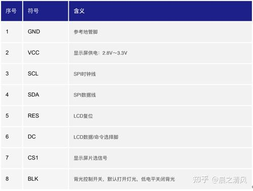
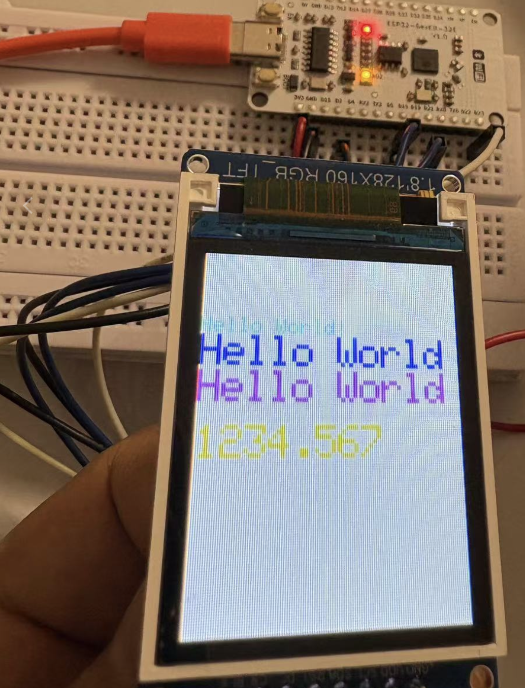

## 一、屏幕基本参数与特性
这里使用的显示屏是：高清 SPI 1.8寸 TFT显示彩屏 OLED液晶屏 st7735。

### 1. ​显示性能​
1. ​分辨率​：128×160像素（部分型号为128×128），支持全视角显示，色彩细腻度达到16位色深（RGB565模式，红色5位、绿色6位、蓝色5位）。
2. 亮度与对比度​：典型亮度300cd/m²，对比度500:1，适用于室内外多种光照环境。
3. ​响应时间​：≤15ms，动态画面无拖影，适合显示简单动画或实时数据。

### 2. 物理特性​

1. ​尺寸​：1.8英寸对角，厚度仅1.2mm，适用于小型便携设备。
2. 接口类型​：支持SPI（串行外设接口）通信，部分型号兼容8位并行接口。
3. 功耗​：工作电压3.3V，待机功耗低至0.5mA，适合电池供电场景。

## 二、SPI接口与硬件设计

### SPI接口优势​
1. ​引脚精简​：仅需SCLK（时钟）、MOSI（主出从入）、CS（片选）、DC（数据/命令选择）、RST（复位）等5-6根线，节省MCU资源。
2. ​传输速率​：最高支持40MHz时钟频率，实测刷新率可达60fps（128×160全屏）。
3. ​灵活性​：支持软件模拟SPI（GPIO控制）或硬件SPI（专用外设加速），适配不同MCU型号。

### ​硬件连接要点​

1. 关键引脚定义​：
    1. ​CS​：片选信号，低电平激活通信。
    2. DC​：高电平传输像素数据，低电平发送控制命令。
    3. RST​：硬件复位引脚，初始化时需拉低至少100ms。
2. ​电平匹配​：需确保MCU与屏幕电平一致（通常为3.3V），5V系统需加电平转换电路。

## 三、显示屏引脚功能说明


## 四、 显示屏和 esp32硬件连接方式


| 模块	| 型号/参数 | 连接方式 | ESP32引脚分配 |
| --- | --- | --- | --- |
| 主控	| ESP32-WROOM-32D| 	- | 	- | 
| TFT屏幕| 	ST7735S 1.8 SPI	| SPI | 	SCK=18, MOSI=23| 
| | | 控制线	| CS=5, DC=21, RST=5| 
| | 	| 背光控制| BLK=4 (PWM调光)| 
| WiFi模块| 	板载| 	-| 	-| 


| 屏幕引脚	| esp32 引脚 |
| --- | --- |
| sck/scl | Pin(18) |
| mosi/sda | Pin(23) |
| miso | Pin(19) |
| DC   | Pin(21) |
| Reset/rst | Pin(2) |
| CS    | Pin(5) |

## 五、驱动测试
需要下面连个文件，一个是 7735 的驱动程序，另外一个是用到的字符库文件，这个只是英文常用字符库，没有汉字库，汉字库后面可以再介绍如何添加进来使用。这两个文件可以联系我拿，后面我也会为这个项目整理一下专门的仓库存放这些代码。

1. 驱动文件：st7735.py，存放在 lib目录下。
2. 字库文件：sysfont.py，存放在 lib目录下。

``` python
from machine import Pin, SoftSPI
from drivers.st7735 import TFT7735
from drivers.sysfont import sysfont

# 初始化SPI
spi = SoftSPI(baudrate=600000000, polarity=0, phase=0, sck=Pin(18), mosi=Pin(23), miso=Pin(19))
display = TFT7735(spi, 21, 2, 5)
display.initg()#按RGB中的g重置屏幕
display.rgb(True)
display.fill(TFT7735.BLACK)
display.invertcolor(True)#反转屏幕颜色，负片，反色

display.fill(TFT7735.BLACK)
v = 30
display.text((0, v), "Hello World!", TFT7735.RED, sysfont, 1, nowrap=True)
v += sysfont["Height"]
display.text((0, v), "Hello World!", TFT7735.YELLOW, sysfont, 2, nowrap=True)
v += sysfont["Height"] * 2
display.text((0, v), "Hello World!", TFT7735.GREEN, sysfont, 2, nowrap=True)
v += sysfont["Height"] * 3
display.text((0, v), str(1234.567), TFT7735.BLUE, sysfont, 2, nowrap=True)
```
## 五、测试结果



## 六、总结
本文档介绍了使用ST7735驱动的TFT-LCD显示屏的初始化设置及其显示效果。通过SPI接口连接显示屏，并设置了不同颜色的文本显示。实验结果显示，显示屏能够正确显示不同颜色的“Hello World”文本，并且能够显示数字。

下次实验预告

下次实验将重点探讨在中文字体显示上的实现方法，包括字体文件的准备、编码转换的实现。