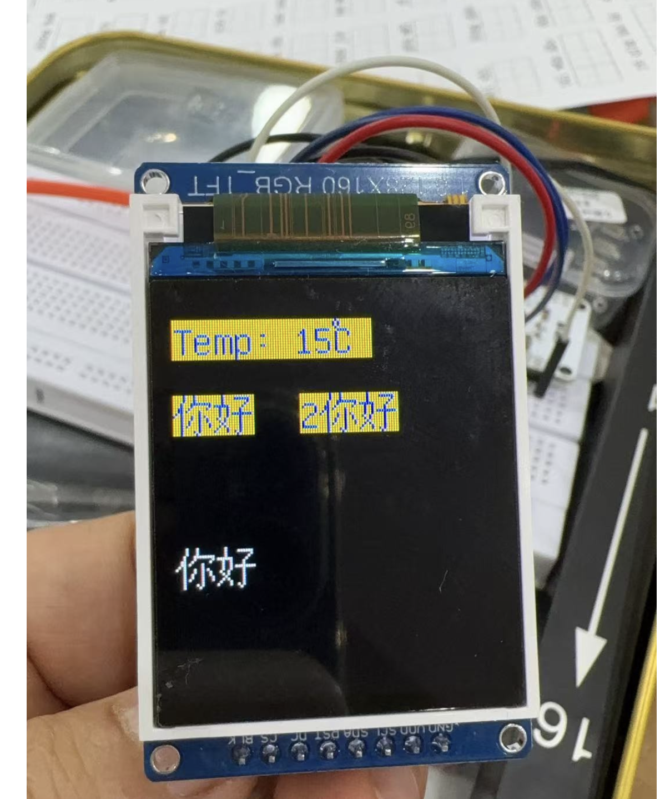

## 一、介绍
前面介绍了ST7735的显示，但是显示的只是英文字符，如果想要显示中文，需要使用到 ufont 库，这个库可以显示中文字符，但是需要自己添加字库，下面介绍如何添加字库。

## 三、添加字库
1. 下载字库文件，下载地址：https://github.com/olikraus/u8g2/wiki/fntlistall
2. 将下载的文件解压，将解压后的文件放到 ufont 文件夹下，如下图所示：

3. 修改 ufont.py 文件，将 ufont.py 文件中的 ufont 字典修改为如下所示：

## 二、ufont 库介绍

https://github.com/AntonVanke/MicroPython-uFont

Micropython μFont 是 Micropython 的字体模块，可以用来显示所有Unicode字符。
这个项目中可以支持 SSD1306 OLED屏幕，ST7735 LCD屏幕，1.54英寸的e-Paper (只要是使用FrameBuffer的屏幕都支持，但本项目提供的驱动只有这三种)。

MicroPython-uFont 是 AntonVanke 开发的一个开源项目，专为资源有限的 MicroPython 环境设计。这个库包含一系列预处理的TrueType 字体，它们被转换成 Python 字典，可以直接在 MicroPython 中使用，无需额外的解析或编译步骤。这对于在ESP32这类小型硬件上实现文本显示非常有帮助。

### 特点与优势
1. 低资源占用: 在资源受限的环境下依然能流畅运行。
2. 跨平台兼容: 支持多种MicroPython兼容设备，具有良好的硬件适应性。
3. 灵活性: 用户可以定制字体大小和样式，根据需求调整视觉效果。
4. 易用性: API简洁明了，降低学习和使用门槛。

其中都有相应的示例文件，可以参考。所以整个过程并不是很复杂，这里的驱动也可以暂时就是用他提供的驱动，但是在后面图片展示的时候需要对驱动程序进行修改。
### 硬件要求
1. 运行micropython的开发板，且micropython>=1.17
2. 使用SSD1306驱动芯片的OLED屏幕或者是ST7735驱动芯片的LCD屏幕亦或是1.54英寸的e-Paper (只要是使用FrameBuffer的屏幕都支持，但本项目提供的驱动只有这三种)
3. 如果想要在OLED或者e-Paper上使用ufont显示支持GB2312的所有字符，则至少 230Kbyte 的空闲 ROM 空间和 20 Kbyte的空闲内存 如果想要在ST7735上使用ufont显示支持GB2312的所有字符，则至少 230Kbyte 的空闲 ROM 空间和 100 Kbyte的空闲内存

字库驱动：ufont.py
字库文件：unifont-14-12917-16.v3.bmf，这个文件有 400多 k 大。

## 五、测试程序
1. st7735驱动：st7735.py，存放在 drivers 目录下。
2. 字库驱动文件：ufont.py，存放在 drivers 目录下。
3. 字库数据文件：unifont-14-12917-16.v3.bmf，存放在 data 目录下。

``` python
from machine import Pin, SoftSPI
from drivers.st77xx import ST7735
from drivers.ufont import BMFont

spi = SoftSPI(baudrate=600000000, polarity=0, phase=0, sck=Pin(18), mosi=Pin(23), miso=Pin(19))
tftdisplay = ST7735(spi=spi, cs=5, dc=21, rst=2, width=128, height=160, rotate=0)
tftdisplay.clear()

font = BMFont("data/unifont-14-12917-16.v3.bmf")
font.text(tftdisplay, "Temp: 15℃", 0, 10, color=0xff00, bg_color=0x00ff, show=True, clear=True)
font.text(tftdisplay, "你好", 0, 40, color=0xff00, bg_color=0x00ff, show=True)
font.text(tftdisplay, "2你好", 50, 40, color=0xff00, bg_color=0x00ff)
font.text(tftdisplay, "你好", 0, 100, show=True)
```
## 五、测试结果


## 六、总结
通过这个例子，我们了解了如何添加字库，以及如何使用字库，字库的添加和显示都比较简单，但是字库的添加需要一定的时间，所以如果想要使用字库，需要提前准备好字库文件。

这里也有点反复，之前用的驱动和这个字库驱动不匹配，所以最终还是使用了 MicroPython-uFont 中的驱动，但是对他的偏移设置做了一点点的调整，之后才最终显示完整。

### 下期预告
下一期准备做图片的显示，这里估计也要折腾一阵子，因为图片的显示需要使用到 uimage 库，这个库需要使用到图片的压缩，所以需要先对图片进行压缩，然后才能使用，所以这里需要先学习一下图片的压缩，然后才能继续后面的内容。