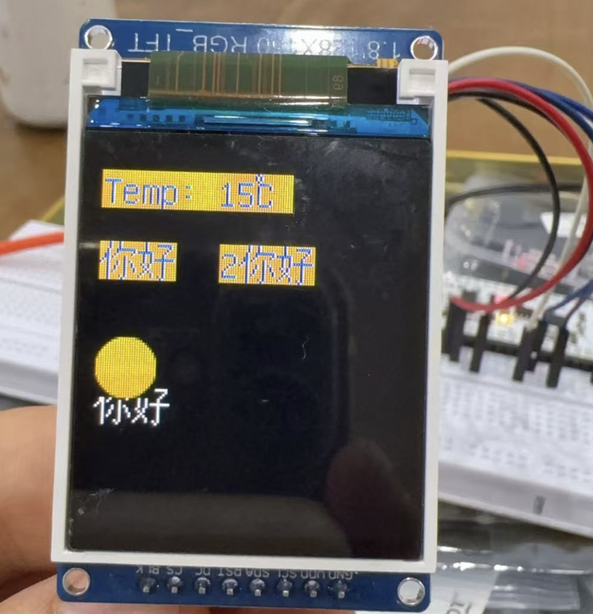

## 一、介绍
今天这里再介绍怎么显示图片。

## 二、驱动准备
驱动仍然使用 st77xx，但是这个驱动需要修改，给加了 show_image 函数，这个函数是用来显示图片的，这个函数在 st77xx.py 的 ST7735 类中，代码如下所示：
 
``` python
def show_image(self, x, y, width, height, img_data):
    self.set_windows(x, y, x + width - 1, y + height - 1)
    self.write_data(img_data)    # 修正显示数据写入命令
```
## 三、图片数据准备
因为目前看 microPython 中没有对图片转换直接支持的库，所以需要做一些转换，把图片转为显示需要的像素级别的数据文件，再把这些数据通过 spi 写入到屏幕进行显示。

这里是一个把 png 图片转为数据的 python 脚本，可以参考。这里使用了知心天气的图标，并且我把图标都统一转换为了 25x25 的。
``` python
import struct
import numpy as np
from PIL import Image

def color565(r, g, b):
    """24位RGB转16位RGB565格式 (用于LCD屏幕)"""
    return (r & 0xf8) << 8 | (g & 0xfc) << 3 | b >> 3

def imgstorgb565(imgsid, width, height):
    img_path = f"../data/imgs/{imgsid}@1x.png"
    out_path = f"../data/imgsdat/{imgsid}@1x.dat"
    """将图片转换为RGB565格式"""
    img = Image.open(img_path)
    print(f"格式:{img.format}, 尺寸:{img.size}, 模式:{img.mode}")
    img = img.convert("RGB")
    img = img.resize((width, height),Image.LANCZOS)
    print(f"格式:{img.format}, 尺寸:{img.size}, 模式:{img.mode}")

    img_data = np.array(img)  # 三维数组 (height, width, 3)
    print(img_data.shape)

    # 写入到目标文件
    with open(out_path, "wb") as f:
        for line in img_data:
            for dot in line:
                print(dot)
                # 小端字节序写入
                packed = struct.pack("<H", color565(*dot))
                f.write(packed[::-1])  # 字节序反转

def main():
    # 读取图片
    for imgsid in range(0, 1):
        imgstorgb565(imgsid, 25, 25)
    imgstorgb565(99, 25, 25)

if __name__ == '__main__':
    main()
```
## 五、驱动测试
``` python
from machine import SoftSPI,Pin

from drivers.st77xx import ST7735
from drivers.ufont import BMFont


def show_image(imgurl):
    global tftdisplay
    with open(imgurl, "rb") as f:
        # 验证文件尺寸
        print("fsize: ", len(f.read()))
        #if len(f.read()) != 25 * 25:
        #    return
        
        f.seek(0)  # 重置文件指针
        buffer = f.read(1250)
        tftdisplay.show_image(0, 0, 24, 24, buffer)

if __name__ == "__main__":
    global tftdisplay
    
    spi = SoftSPI(baudrate=600000000, polarity=0, phase=0, sck=Pin(18), mosi=Pin(23), miso=Pin(19))
    tftdisplay = ST7735(spi=spi, cs=5, dc=21, rst=2, width=128, height=160, rotate=0)
    tftdisplay.clear()


    font = BMFont("data/unifont-14-12917-16.v3.bmf")
    font.text(tftdisplay, "Temp: 15℃", 0, 10, color=0xff00, bg_color=0x00ff, show=True, clear=True)
    font.text(tftdisplay, "你好", 0, 40, color=0xff00, bg_color=0x00ff, show=True)
    font.text(tftdisplay, "2你好", 50, 40, color=0xff00, bg_color=0x00ff)
    font.text(tftdisplay, "你好", 0, 100, show=True)

    show_image("data/imgsdat/0@1x.dat")

```
## 五、测试结果

