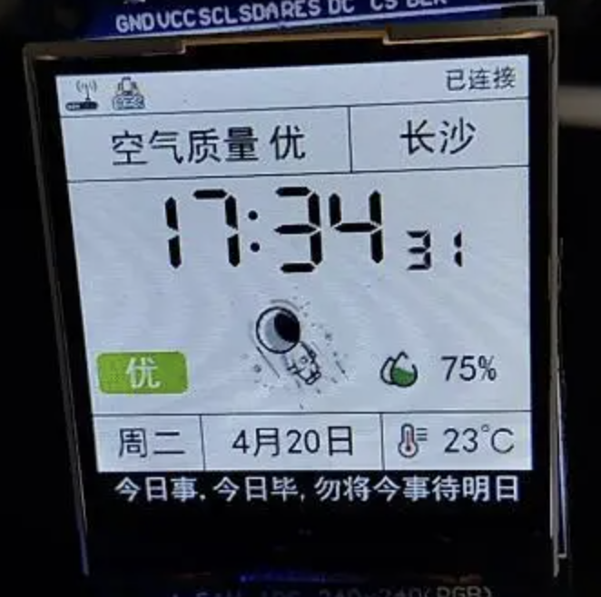
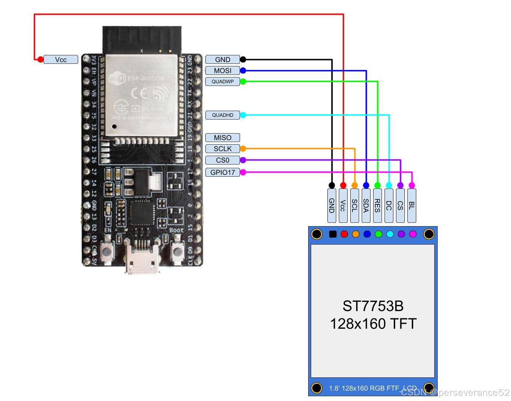
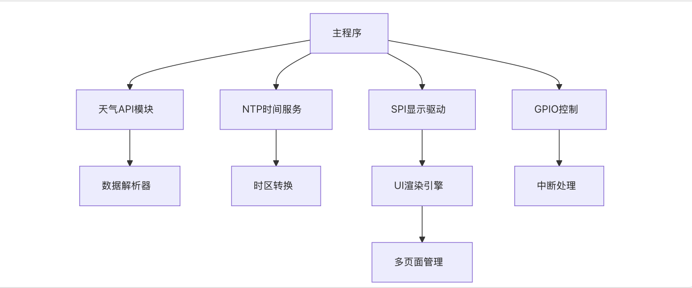

## 一、项目介绍
看到网上有一个比较不错的案例，想自己使用 microPython 来实现一个。实现类似的天气时钟，如下图所示。

## 二、项目实现介绍
实现上我想分成 4～5 个部分来逐步介绍整个设计开发过程。
1. 介绍硬件连接调测，主要介绍 esp32 与 1.8 TFT 显示屏的连接和基本调测。
2. 介绍显示屏幕上怎么展示文字信息，包括中文字库的显示。
3. 介绍显示屏幕上怎么展示天气图标，包括天气图标和温度图标。
4. 介绍显示屏幕上怎么展示时间信息，包括时间、日期、星期。
5. 介绍显示屏幕上划线布局，组装成一个完整的天气时钟。

整体代码开发完成之后会分享到 github 上，方便大家学习。也欢迎大家测试提交代码。
## 三、硬件链接

## 四、软件架构

## 五、项目目录

  
  
  
